# Architecture Documentation

**ManuMu Studio Authentication** - System Architecture and Design

---

## Overview

This document describes the high-level architecture, data flows, and design decisions for ManuMu Studio Authentication.

---

## System Architecture

### High-Level Components

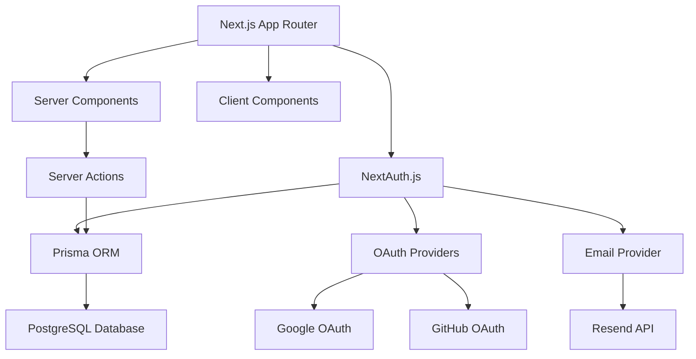

### Technology Stack

- **Frontend**: Next.js 15 App Router, React 18, Tailwind CSS + Framer Motion
- **Authentication**: NextAuth.js v4 (Auth.js)
- **Database**: Prisma ORM + PostgreSQL (Neon Serverless)
- **Email**: Resend API (with SMTP fallback)
- **Validation**: Zod schemas
- **Language**: TypeScript (strict mode)

---

## Authentication Flow

### Email/Password Sign-Up Flow

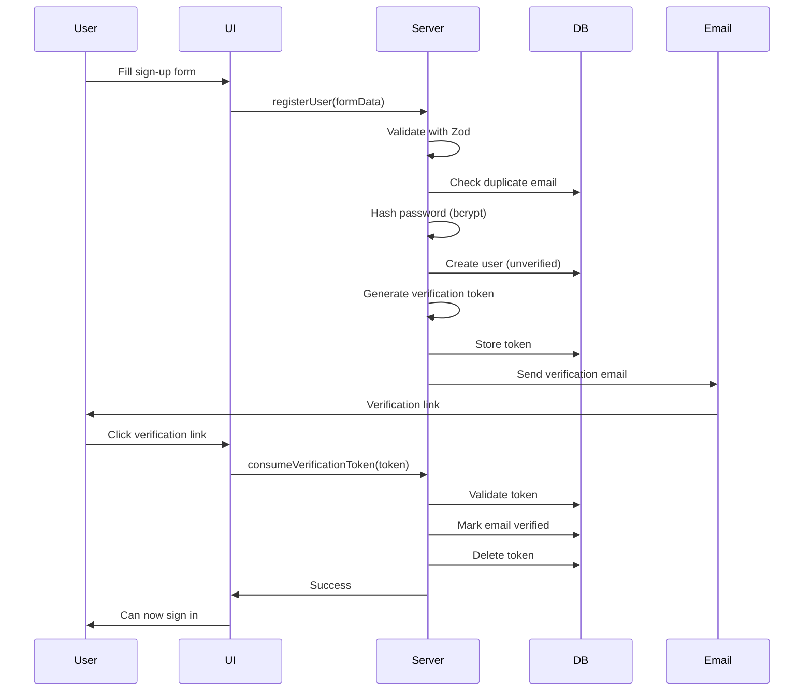

### Email/Password Sign-In Flow

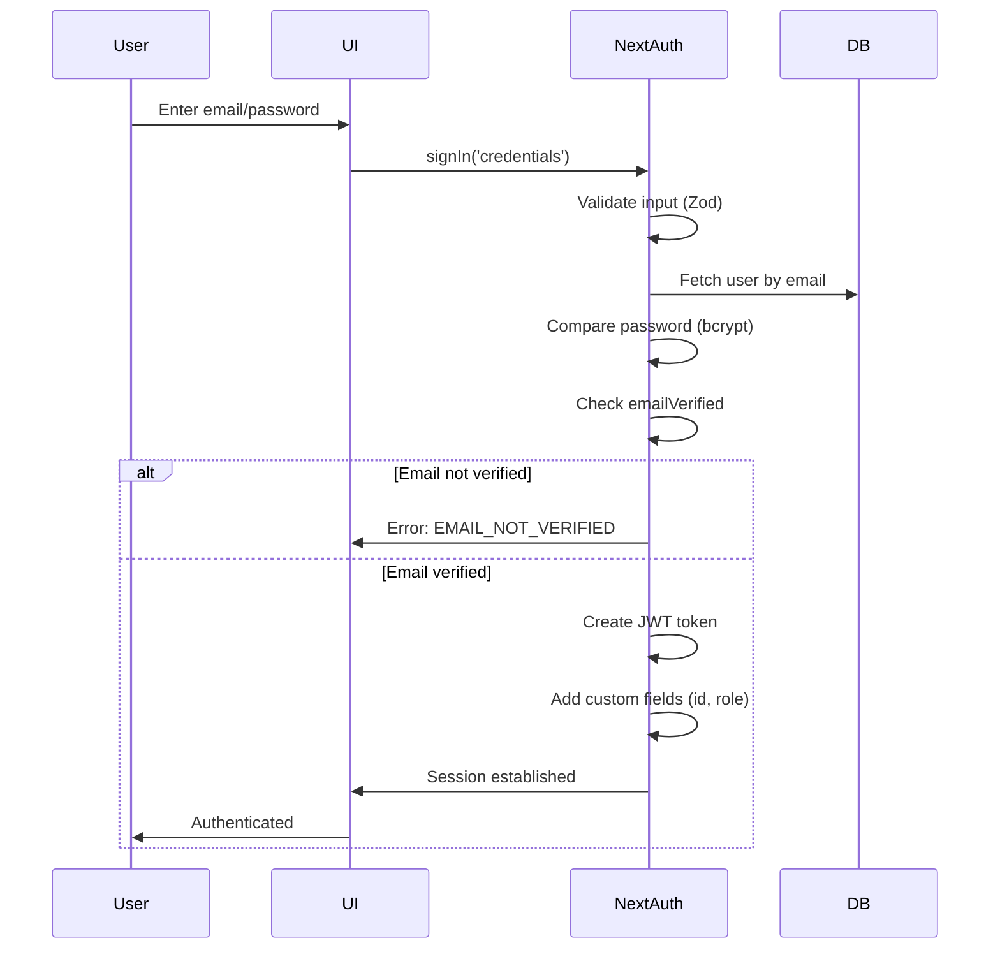

### OAuth Sign-In Flow

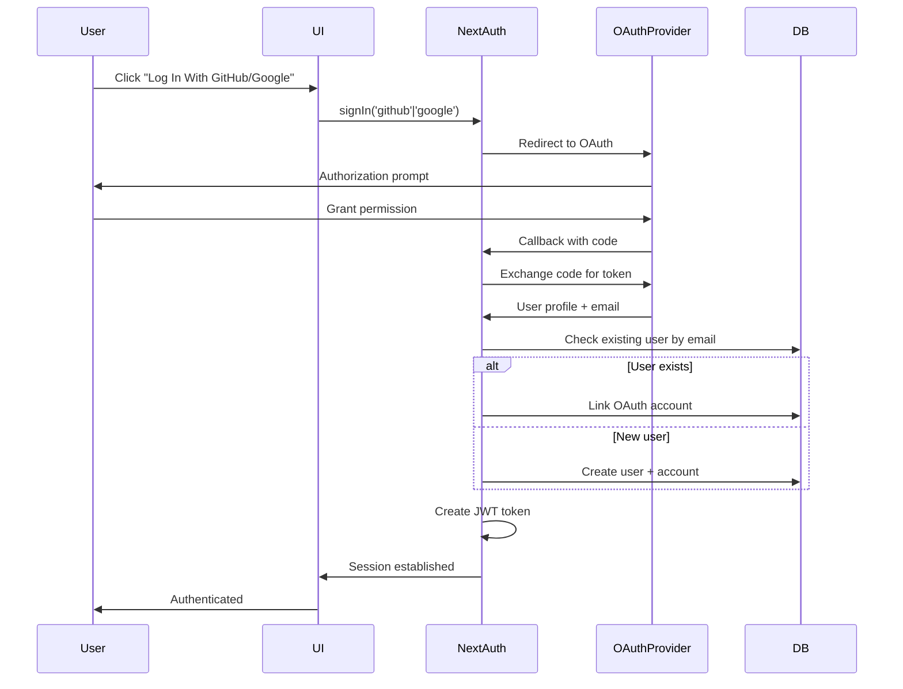

---

## Data Flow

### Session Management

```mermaid
graph LR
    A[User Sign-In] --> B[NextAuth authorize]
    B --> C[Create JWT Token]
    C --> D[Store in HTTP-only Cookie]
    D --> E[Client Request]
    E --> F[Server Component]
    F --> G[getServerSession]
    G --> H[Verify JWT]
    H --> I[Hydrate Session]
    I --> J[Render with Session]
```

### Email Verification Flow

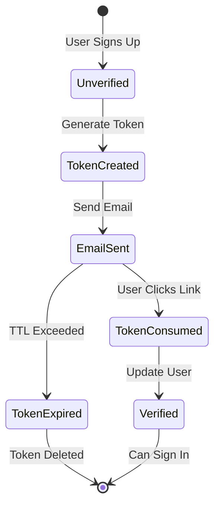

---

## Project Structure

### Feature-Based Architecture

```
src/
├── app/                    # Next.js App Router
│   ├── (public)/          # Public routes
│   ├── (auth)/            # Auth pages
│   ├── (dashboard)/       # Protected routes
│   └── api/               # API routes
│
├── features/
│   └── auth/              # Authentication feature
│       ├── components/    # UI components
│       ├── server/        # Server logic
│       ├── lib/           # Utilities
│       └── types/         # TypeScript types
│
└── lib/                   # Shared utilities
    ├── validation/        # Zod schemas
    ├── prisma.ts          # Database client
    └── env.ts             # Environment validation
```

### Component Hierarchy

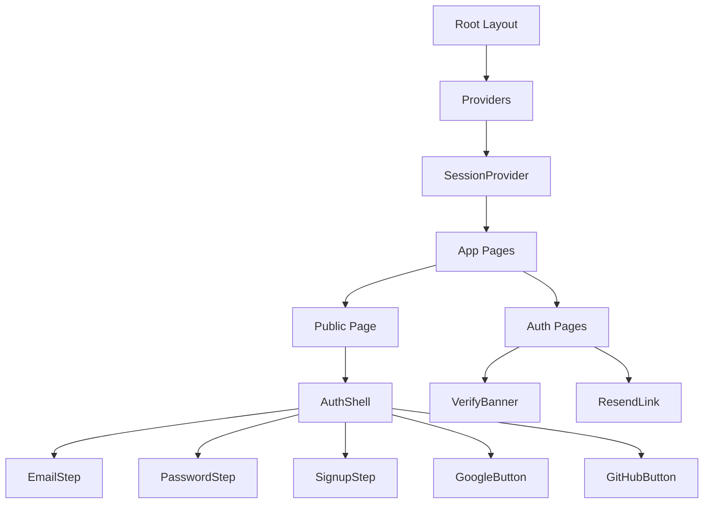

---

## Database Schema

### Core Models

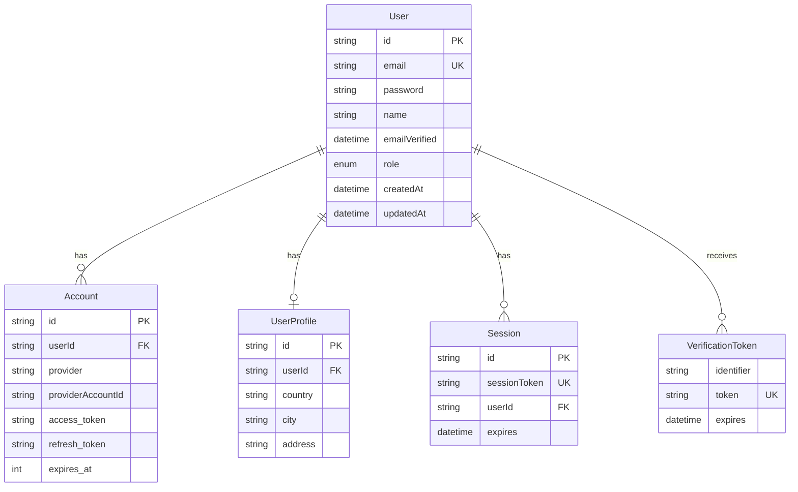

---

## Design Decisions

### Why JWT Strategy?

**Decision**: Use JWT sessions instead of database sessions

**Rationale**:
- Works with both Credentials and OAuth providers
- Stateless - no database queries for session validation
- Better performance for serverless deployments
- Scales horizontally without session storage

**Trade-offs**:
- Token size limits (mitigated by storing minimal data)
- Cannot revoke sessions server-side (future: token blacklist)

### Why Feature-Based Architecture?

**Decision**: Organize code by feature rather than by type

**Rationale**:
- Related code lives together
- Easier to understand and maintain
- Clear boundaries between features
- Scalable for team collaboration

### Why Email Verification for Credentials?

**Decision**: Require email verification before credentials sign-in

**Rationale**:
- Prevents fake/bot accounts
- Confirms email ownership
- Improves data quality
- Foundation for password reset

**Trade-off**:
- Additional step for users (mitigated by clear UX)

### Why Account Linking?

**Decision**: Enable automatic account linking by email

**Rationale**:
- Better user experience (no manual linking)
- OAuth providers verify email ownership
- Same email = same user (intuitive)

**Security**:
- Only for trusted OAuth providers
- Email verified by provider
- No account takeover risk

---

## API Architecture

### NextAuth.js Integration

```mermaid
graph LR
    A[Client] --> B[/api/auth/[...nextauth]]
    B --> C[NextAuth Handler]
    C --> D[Auth Options]
    D --> E[Providers]
    D --> F[Callbacks]
    D --> G[Adapter]
    G --> H[Prisma]
    H --> I[PostgreSQL]
```

### Server Actions

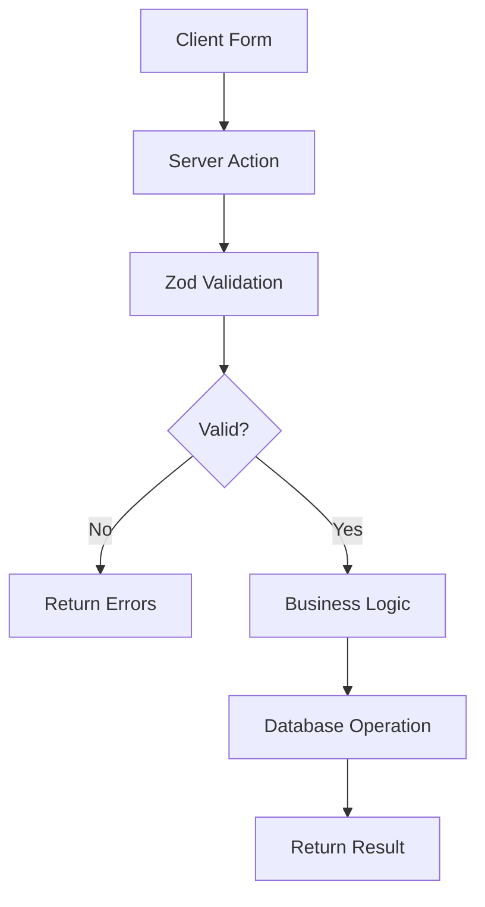

---

## Security Architecture

### Authentication Layers

1. **Input Validation**: Zod schemas on client and server
2. **Password Security**: bcrypt hashing (10 salt rounds)
3. **Session Security**: JWT signed with strong secret
4. **Email Verification**: Token-based with TTL
5. **OAuth Security**: Provider-verified email addresses

### Security Flow

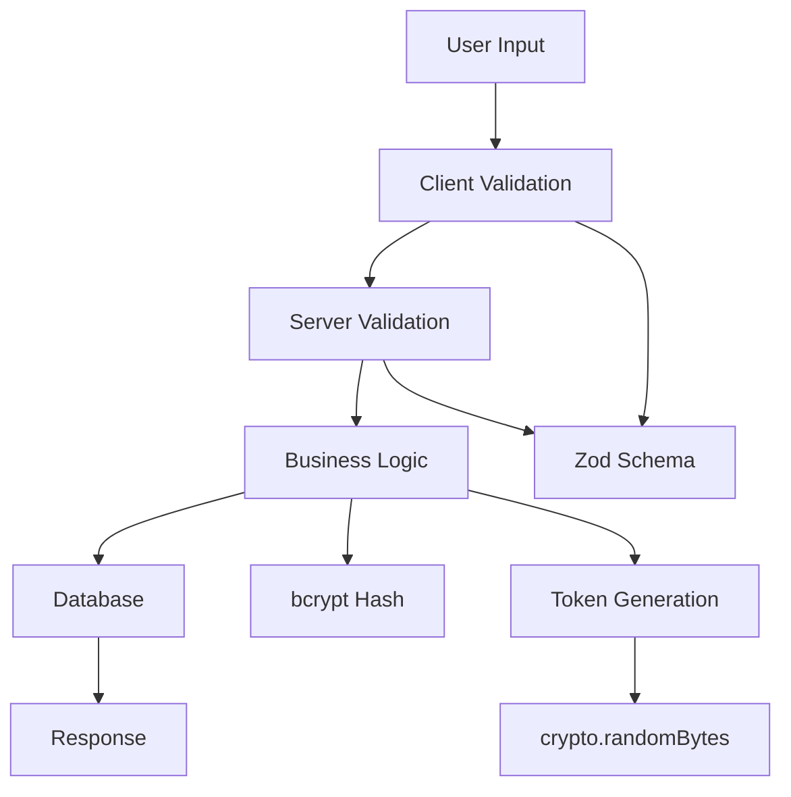

---

## Deployment Architecture

### Production Infrastructure

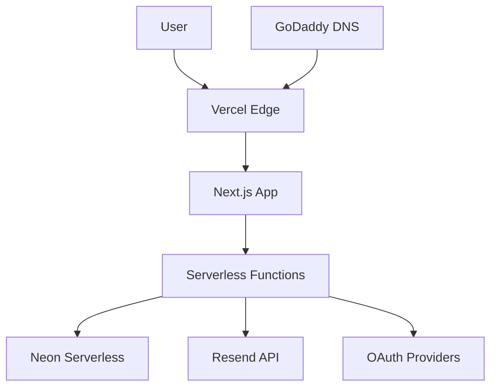

### Environment Configuration

- **Vercel**: Application hosting and serverless functions
- **Neon Serverless**: PostgreSQL database with automatic scaling
- **Resend**: Email delivery service
- **GoDaddy**: Custom domain management

---

## Future Enhancements

### Planned Architecture Improvements

- **Rate Limiting**: Redis-based rate limiting for API endpoints
- **Caching**: Redis cache for session validation
- **Monitoring**: Application performance monitoring
- **Analytics**: User authentication analytics
- **Testing**: Comprehensive test suite (unit, integration, E2E)

---

**Last Updated**: January 27, 2025

