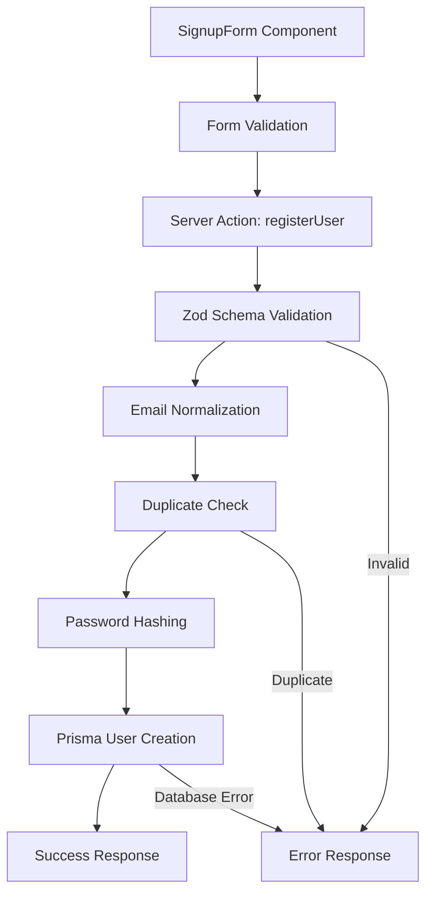

# ENTRY-1 — User Registration (Signup UI + Server Action)

**Date:** October 4, 2025  
**Type:** Feature Implementation  
**Status:** ✅ Complete

---

## Overview

Implemented the complete user registration flow for **ManuMu Authentication**, enabling users to create accounts through a polished UI with robust server-side validation and secure password handling.

---

## What We Built

### User Registration Flow

A complete signup experience with:
- **Client-side form** with real-time validation
- **Server action** for secure user creation
- **Password hashing** using bcrypt
- **Email normalization** (lowercase, trimmed)
- **Duplicate email detection** with user-friendly error messages
- **User profile creation** (optional fields: country, city, address)

### Security Features

- **Password Hashing**: bcryptjs with 10 salt rounds
- **Input Validation**: Zod schemas for all form fields
- **Email Normalization**: Prevents duplicate accounts with case variations
- **Type Safety**: Full TypeScript coverage with discriminated unions

---

## Architecture

### Component Structure



### Server Action Flow

1. **Form Submission** → Client sends FormData
2. **Zod Validation** → Validates email, password, optional fields
3. **Email Normalization** → `email.trim().toLowerCase()`
4. **Duplicate Check** → Query existing user by email
5. **Password Hashing** → `bcrypt.hash(password, 10)`
6. **Database Transaction** → Create user + profile in single transaction
7. **Response** → Return `ActionResult` with success or errors

---

## Files Created/Modified

### Components
- `src/features/auth/components/SignupForm/SignupForm.tsx` - Registration form component
- `src/features/auth/components/SignupForm/SignupForm.module.scss` - Form styles
- `src/features/auth/components/SignupForm/SignupForm.types.ts` - TypeScript types

### Server Actions
- `src/features/auth/server/actions/signup.ts` - User registration server action
- `src/features/auth/server/actions/types.ts` - Unified `ActionResult` type

### Validation
- `src/lib/validation/signup.ts` - Zod schema for signup form
- `src/lib/validation/fields.ts` - Shared field validation (email, password)

### UI Components
- `src/features/auth/components/AuthModal/AuthModal.tsx` - Modal container for auth flows

---

## Technical Details

### Password Security

```typescript
const hash = await bcrypt.hash(data.password, 10);
```

- **Algorithm**: bcrypt (industry standard)
- **Salt Rounds**: 10 (balanced security/performance)
- **Storage**: Hashed password stored in database, never plaintext

### Email Normalization

```typescript
const email = data.email.trim().toLowerCase();
```

Prevents:
- Duplicate accounts: `User@Example.com` vs `user@example.com`
- Case-sensitivity issues
- Leading/trailing whitespace problems

### Error Handling

Unified error response format:

```typescript
type ActionResult =
  | { ok: true }
  | { ok: false; errors: { 
      formErrors?: string[];
      fieldErrors?: Record<string, string[]>;
    }};
```

Enables:
- Consistent error display across forms
- Field-specific validation messages
- Form-level error messages

---

## User Experience

### Form Validation States

1. **Idle State**: Clean form, ready for input
2. **Validation Errors**: Real-time feedback on blur/change
3. **Submission Loading**: Disabled form during processing
4. **Success State**: Toast notification + form reset
5. **Error State**: Clear error messages with actionable guidance

### Screenshots

#### 1. Modal Idle State


#### 2. Validation Errors


#### 3. Duplicate Email Error


#### 4. Success Toast


---

## Testing

### Manual Test Scenarios

- ✅ Valid signup with all fields
- ✅ Valid signup with minimal fields (email + password only)
- ✅ Invalid email format → validation error
- ✅ Weak password (< 8 chars) → validation error
- ✅ Duplicate email → user-friendly error message
- ✅ Password mismatch → validation error
- ✅ Network error handling → graceful degradation

### Database Verification

- ✅ User record created with hashed password
- ✅ UserProfile record created (if provided)
- ✅ Email stored in normalized format
- ✅ Timestamps (`createdAt`, `updatedAt`) set correctly

---

## Rationale

### Why Server Actions?

- **Security**: Sensitive operations (password hashing) stay on server
- **Performance**: No API route overhead
- **Type Safety**: End-to-end TypeScript from form to database
- **Developer Experience**: Simple async/await pattern

### Why Zod Validation?

- **Type Safety**: Automatic TypeScript type inference
- **Runtime Validation**: Catches invalid data before database
- **Error Messages**: Built-in error formatting
- **Composability**: Reusable schemas across client/server

---

## Impact

This implementation provides:
- ✅ Secure user registration with industry-standard password hashing
- ✅ Excellent user experience with clear validation feedback
- ✅ Type-safe end-to-end flow
- ✅ Foundation for email verification (next phase)

---

## Next Steps

With registration complete, the next phase focuses on:
1. **Email Verification**: Token-based verification flow
2. **Sign-In Flow**: Credentials authentication
3. **Session Management**: Persistent authentication state

---

**Registration Complete** ✅  
*Users can now create accounts securely with a polished, accessible UI.*
