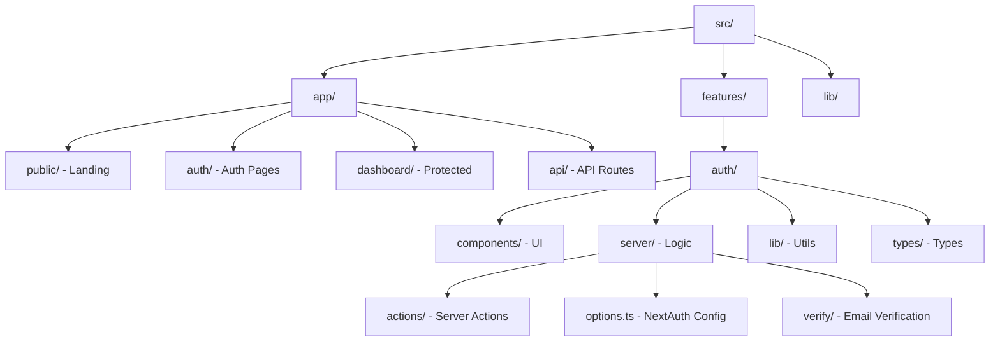
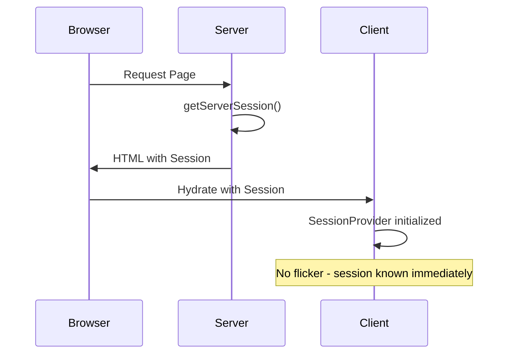

# ENTRY-2 — Authentication UX Polish & Feature-Based Refactor

**Date:** October 8, 2025  
**Type:** Refactor + Feature Enhancement  
**Status:** ✅ Complete

---

## Overview

This entry documents a major architectural refactor and UX improvement for **ManuMu Authentication**, eliminating UI flicker on page load and implementing a complete credentials-based authentication flow within a feature-based architecture.

---

## What We Built

### Critical UX Fix: SSR Session Hydration

**Problem**: Users experienced a flash of unauthenticated content (FOUC) on page load, causing a jarring visual jump.

**Solution**: Server-side session fetching with client hydration eliminates all flicker.

### Feature-Based Architecture Migration

Reorganized the entire codebase into a scalable, feature-based structure that separates concerns and improves maintainability.

### Complete Authentication Flow

Implemented full credentials-based authentication:
- Sign-in with email/password
- Sign-up with validation
- Session persistence
- Secure logout

---

## Architecture Changes

### Before: Flat Structure

```
src/
├── app/
├── components/
└── lib/
```

### After: Feature-Based Structure



### Server/Client Boundary



---

## Technical Implementation

### SSR Session Hydration

**Server Component** (`app/layout.tsx`):
```typescript
export default async function RootLayout({ children }) {
  const session = await getServerSession(authOptions);
  return (
    <html lang="en">
      <body>
        <Providers session={session}>{children}</Providers>
      </body>
    </html>
  );
}
```

**Client Component** (`app/providers.tsx`):
```typescript
'use client';
export default function Providers({ children, session }) {
  return (
    <SessionProvider session={session}>
      <ChakraProvider>{children}</ChakraProvider>
    </SessionProvider>
  );
}
```

**Impact**: 
- ✅ Zero flicker on page load
- ✅ Instant authentication state recognition
- ✅ Better perceived performance

### Unified Action Result Contract

Standardized error handling across all server actions:

```typescript
export type ActionResult =
  | { ok: true }
  | { ok: false; errors: { 
      formErrors?: string[];
      fieldErrors?: Record<string, string[]>;
    }};
```

**Benefits**:
- Consistent error display patterns
- Type-safe error handling
- Reusable error components

### NextAuth Configuration

```typescript
export const authOptions: NextAuthOptions = {
  adapter: PrismaAdapter(prisma),
  session: { strategy: "jwt" },
  providers: [
    Credentials({
      // Email/password validation
      // Email verification gate
    }),
  ],
  callbacks: {
    jwt: ({ token, user }) => {
      // Add custom fields to JWT
    },
    session: ({ session, token }) => {
      // Hydrate session with custom fields
    },
  },
};
```

---

## Files Created/Modified

### Architecture
- `src/features/auth/` - New feature-based directory structure
- `src/app/(public)/` - Public landing page route group
- `src/app/(auth)/` - Authentication pages route group
- `src/app/(dashboard)/` - Protected routes route group

### Components
- `src/features/auth/components/AuthModal/` - Unified auth modal
- `src/features/auth/components/AuthLayout/` - Tabbed auth layout
- `src/features/auth/components/SignInForm/` - Sign-in form
- `src/features/auth/components/SignupForm/` - Sign-up form
- `src/features/auth/components/UserCard/` - User display component

### Server
- `src/features/auth/server/actions/signin.ts` - Sign-in server action
- `src/features/auth/server/actions/signup.ts` - Sign-up server action
- `src/features/auth/server/options.ts` - NextAuth configuration

### Documentation
- Component-level README files for all major components
- Architecture documentation

---

## User Experience Improvements

### Before: Flicker Problem

```
1. Page loads → Shows "Sign In" button
2. JavaScript loads → Fetches session
3. Session found → Changes to "Welcome, User"
4. Visual jump → Poor UX
```

### After: Seamless Experience

```
1. Page loads → Server knows session
2. HTML includes session data
3. Client hydrates → No visual change
4. Smooth experience → Professional UX
```

---

## Testing

### Manual Smoke Tests

- ✅ Sign up with validation errors
- ✅ Sign up with duplicate email handling
- ✅ Sign in with invalid credentials
- ✅ Sign in with valid credentials
- ✅ Sign out clears session correctly
- ✅ **SSR hydration: Hard refresh shows authenticated state instantly (no flicker)**
- ✅ Session persists across navigation
- ✅ Session persists across page reloads

### Build Verification

- ✅ TypeScript: 0 errors
- ✅ Build time: 3.5s
- ✅ All routes generated correctly
- ✅ No hydration mismatches

---

## Rationale

### Why Feature-Based Architecture?

**Scalability**: 
- Easy to add new features without cluttering
- Clear boundaries between features
- Predictable file locations

**Maintainability**:
- Related code lives together
- Easier to understand and modify
- Better code organization

**Team Collaboration**:
- Clear ownership boundaries
- Reduced merge conflicts
- Easier code reviews

### Why SSR Session Hydration?

**Performance**:
- Eliminates client-side session fetch
- Reduces time to interactive
- Better Core Web Vitals

**User Experience**:
- No visual flicker
- Instant authentication state
- Professional feel

**SEO**:
- Server-rendered content
- Better search engine indexing
- Improved accessibility

---

## Impact

This refactor establishes:
- ✅ **Production-ready architecture** - Scalable, maintainable structure
- ✅ **Zero-flicker UX** - Professional user experience
- ✅ **Type-safe authentication** - End-to-end TypeScript coverage
- ✅ **Developer experience** - Clear patterns, easy to extend

---

## Next Steps

With the foundation solid, the next phase focuses on:
1. **Email Verification** - Token-based verification flow
2. **OAuth Providers** - Google, GitHub integration
3. **Protected Routes** - Route-level authentication guards
4. **Password Reset** - Secure password recovery flow

---

**Refactor Complete** ✅  
*The codebase now has a solid, scalable architecture with excellent UX and developer experience.*
