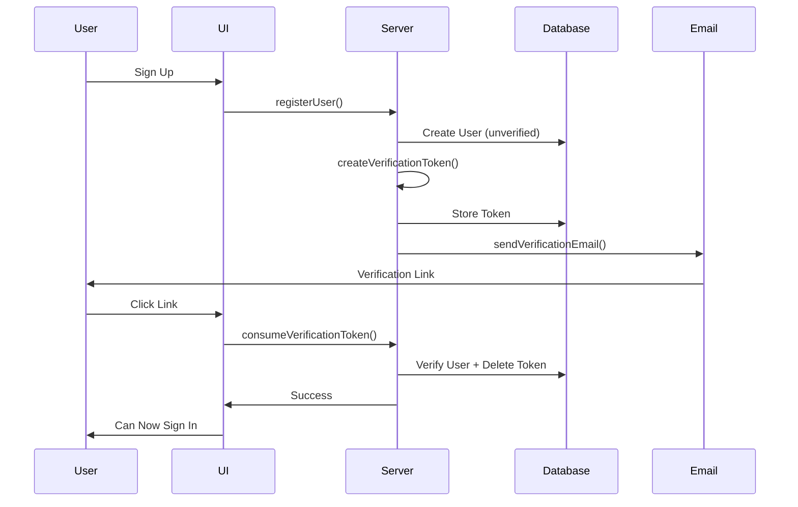
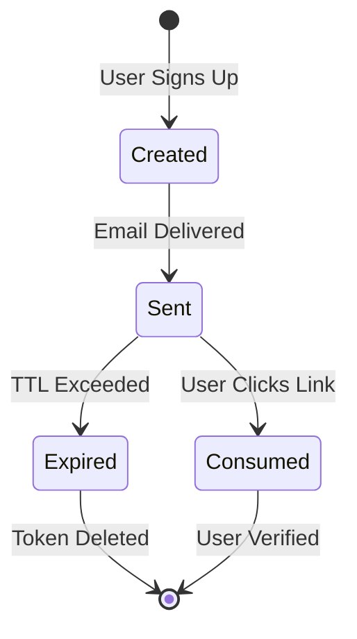

# ENTRY-3 — Production-Grade Email Verification

**Date:** October 10, 2025  
**Type:** Feature Implementation  
**Status:** ✅ Complete

---

## Overview

Implemented a complete, production-ready email verification system for **ManuMu Authentication**, enforcing account verification before sign-in to eliminate fake accounts and improve email deliverability. The system includes secure token generation, cooldown protection, beautiful HTML emails, and seamless UX.

---

## What We Built

### Complete Verification Flow

A robust email verification system with:
- **Cryptographically secure tokens** (32-byte, base64url encoded)
- **Configurable TTL** (default 30 minutes)
- **Cooldown protection** (prevents spam, default 2 minutes)
- **Atomic transactions** (verify + cleanup in single operation)
- **Beautiful HTML emails** via Resend integration
- **Accessible UI components** with clear feedback

### Security Features

- **Token Security**: `crypto.randomBytes(32)` for cryptographically strong tokens
- **TTL Enforcement**: Tokens expire after configurable time window
- **Cooldown Protection**: Prevents abuse of resend functionality
- **Atomic Operations**: Database transactions ensure data consistency
- **Email Normalization**: Prevents duplicate verification attempts

---

## Architecture

### Verification Flow



### Token Lifecycle



---

## Technical Implementation

### Core Functions

#### 1. Create Verification Token

```typescript
export async function createVerificationToken(email: string) {
  const token = crypto.randomBytes(32).toString("base64url");
  const expires = new Date(Date.now() + TTL_MIN * 60 * 1000);

  await prisma.verificationToken.create({
    data: { identifier: email.toLowerCase().trim(), token, expires },
  });

  const verifyUrl = `${APP_URL}/verify?token=${encodeURIComponent(token)}`;
  return { ok: true as const, token, verifyUrl };
}
```

**Key Features**:
- Cryptographically secure random generation
- Email normalization (lowercase, trimmed)
- Configurable TTL via environment variable
- Returns ready-to-use verification URL

#### 2. Consume Verification Token

```typescript
export async function consumeVerificationToken(token: string) {
  const record = await prisma.verificationToken.findUnique({ where: { token } });
  if (!record) return { ok: false as const, reason: "not-found" as const };
  if (record.expires < new Date()) return { ok: false as const, reason: "expired" as const };

  const user = await prisma.user.findUnique({
    where: { email: record.identifier },
    select: { id: true, emailVerified: true },
  });
  if (!user) return { ok: false as const, reason: "not-found" as const };
  if (user.emailVerified) return { ok: false as const, reason: "already-verified" as const };

  await prisma.$transaction([
    prisma.user.update({ where: { id: user.id }, data: { emailVerified: new Date() } }),
    prisma.verificationToken.deleteMany({ where: { identifier: record.identifier } }),
  ]);

  return { ok: true as const };
}
```

**Key Features**:
- Validates token existence and expiration
- Prevents double-verification
- Atomic transaction (verify + cleanup)
- Type-safe discriminated union for error handling

#### 3. Resend Verification Token

```typescript
export async function resendVerificationToken(email: string) {
  const normalized = email.toLowerCase().trim();
  const user = await prisma.user.findUnique({ where: { email: normalized } });
  if (!user) return { ok: false as const, reason: "not-found" as const };
  if (user.emailVerified) return { ok: false as const, reason: "already-verified" as const };

  // Cooldown check
  const recent = await prisma.verificationToken.findFirst({
    where: { identifier: normalized },
    orderBy: { expires: "desc" },
  });
  if (recent) {
    const cooldownSince = new Date(Date.now() - COOLDOWN_MIN * 60 * 1000);
    if (recent.expires > cooldownSince) {
      return { ok: false as const, reason: "cooldown" as const };
    }
  }

  // Create new token and send email
  const token = crypto.randomBytes(32).toString("base64url");
  const expires = new Date(Date.now() + TTL_MIN * 60 * 1000);
  await prisma.verificationToken.create({
    data: { identifier: normalized, token, expires },
  });

  const verifyUrl = `${APP_URL}/verify?token=${encodeURIComponent(token)}`;
  await sendVerificationEmail({ to: normalized, verifyUrl });

  return { ok: true as const };
}
```

**Key Features**:
- Cooldown protection prevents abuse
- Creates fresh token on each resend
- Validates user state before resending
- Configurable cooldown period

---

## Email Integration

### Resend Provider

```typescript
export async function sendVerificationEmail({ to, verifyUrl, name }: SendArgs) {
  const subject = getVerificationEmailSubject();
  const text = getVerificationEmailText({ name, verifyUrl });
  const html = verifyEmailHtml({ name, verifyUrl });

  if (resend) {
    const { data, error } = await resend.emails.send({
      from,
      to: Array.isArray(to) ? to : [to],
      subject,
      text,
      html,
    });

    if (error) {
      console.error("[Resend] send error:", error);
      throw new Error("EMAIL_SEND_FAILED");
    }

    return;
  }

  // Fallback for dev
  console.log("[DEV EMAIL] To:", to, "\nSubject:", subject, "\n\n", text);
}
```

**Features**:
- Dual format (HTML + plain text)
- Graceful fallback for development
- Observable (logs send IDs)
- Configurable sender address

### Email Templates

- **HTML Template**: Responsive, accessible design
- **Text Template**: Plain text fallback
- **Subject Template**: Dynamic subject line
- **Professional Design**: System fonts, high contrast, minimal styling

---

## UI Components

### VerifyBanner

Displays post-signup notification with:
- Clear call-to-action
- Email address confirmation
- Helpful hints for edge cases
- Accessible ARIA live region

### ResendLink

Intelligent retry button with:
- Loading states
- Emoji-coded feedback
- Handles all error scenarios
- Non-intrusive styling

---

## Next.js 15 Compatibility

### Breaking Change Fix

**Before (Next.js 14)**:
```typescript
export default async function VerifyPage({ searchParams }: { 
  searchParams: { token?: string } 
}) {
  const token = searchParams?.token;  // Direct access
}
```

**After (Next.js 15)**:
```typescript
export default async function VerifyPage(props: { 
  searchParams: Promise<{ token?: string }> 
}) {
  const { token } = await props.searchParams;  // Must await!
}
```

**Why**: Enables streaming and partial prerendering in Next.js 15.

---

## Files Created/Modified

### Server Functions
- `src/features/auth/server/verify/createToken.ts` - Token generation
- `src/features/auth/server/verify/consumeToken.ts` - Token validation
- `src/features/auth/server/verify/resend.ts` - Resend with cooldown

### Email Templates
- `src/features/auth/server/verify/templates/verifyEmail.html.tsx` - HTML template
- `src/features/auth/server/verify/templates/verifyEmail.text.ts` - Text template
- `src/features/auth/server/verify/templates/verifyEmail.subject.ts` - Subject template

### Email Provider
- `src/features/auth/lib/email/provider.ts` - Resend integration

### UI Components
- `src/features/auth/components/VerifyBanner/` - Verification banner
- `src/features/auth/components/ResendLink/` - Resend button

### API Routes
- `src/app/api/auth/verify/resend/route.ts` - Resend endpoint

### Pages
- `src/app/(auth)/verify/page.tsx` - Verification page (Next.js 15 compatible)
- `src/app/(auth)/verify/success/page.tsx` - Success page
- `src/app/(auth)/verify/error/page.tsx` - Error page

---

## Testing

### Manual Test Scenarios

| Scenario | Expected Result | Status |
|----------|----------------|--------|
| Sign up new user | User created, email sent, banner shown | ✅ |
| Click verify link (valid) | Redirect to success, user verified | ✅ |
| Click verify link (expired) | Redirect to error page | ✅ |
| Click verify link (invalid) | Redirect to error page | ✅ |
| Sign in before verify | Error: "EMAIL_NOT_VERIFIED" | ✅ |
| Sign in after verify | Session created, redirect to dashboard | ✅ |
| Resend (within cooldown) | Shows cooldown message | ✅ |
| Resend (after cooldown) | New email sent | ✅ |
| Resend (already verified) | Shows "already verified" message | ✅ |

### Edge Cases Handled

- ✅ User clicks verify link twice → "already verified" message
- ✅ Token expires before click → Friendly error + resend option
- ✅ Network error during resend → Retry button remains functional
- ✅ Resend not configured → Logs to console (dev mode)
- ✅ Invalid email format → Zod validation catches it
- ✅ User deleted between token creation and verification → "not found" error

---

## DNS Configuration

### Production Checklist

**Required Records for `send.yourdomain.com`**:

```
# SPF (Sender Policy Framework)
send.yourdomain.com.  TXT  "v=spf1 include:_spf.resend.com ~all"

# DKIM (DomainKeys Identified Mail)
resend._domainkey.send.yourdomain.com.  CNAME  resend.yourdomain.com

# DMARC (optional but recommended)
_dmarc.send.yourdomain.com.  TXT  "v=DMARC1; p=none; rua=mailto:dmarc@yourdomain.com"
```

**Verification**:
```bash
# Test with standalone script
npx tsx scripts/resend-test.ts

# Check DNS propagation
dig TXT send.yourdomain.com
```

---

## Rationale

### Why Token-Based Verification?

- **Security**: Cryptographically secure tokens
- **Scalability**: No session storage required
- **Flexibility**: Configurable TTL and cooldown
- **User Experience**: Simple click-to-verify flow

### Why Cooldown Protection?

- **Prevents Abuse**: Limits resend requests
- **Reduces Spam**: Protects user inbox
- **Cost Control**: Limits email service usage
- **Better UX**: Prevents accidental spam

### Why Atomic Transactions?

- **Data Consistency**: Verify + cleanup in single operation
- **Error Prevention**: No orphaned tokens
- **Performance**: Single database round-trip

---

## Impact

This implementation provides:
- ✅ **Security**: Eliminates fake/bot accounts
- ✅ **Deliverability**: Professional emails improve sender reputation
- ✅ **User Experience**: Clear, accessible verification flow
- ✅ **Developer Experience**: Type-safe, observable, well-documented

---

## Next Steps

With email verification complete, the next phase focuses on:
1. **OAuth Providers** - Google, GitHub integration
2. **Password Reset** - Reuse verification token pattern
3. **Magic Link Sign-In** - Passwordless authentication
4. **Multi-Factor Authentication** - TOTP with email fallback

---

**Email Verification Complete** ✅  
*Users must now verify their email before signing in, improving security and data quality.*
