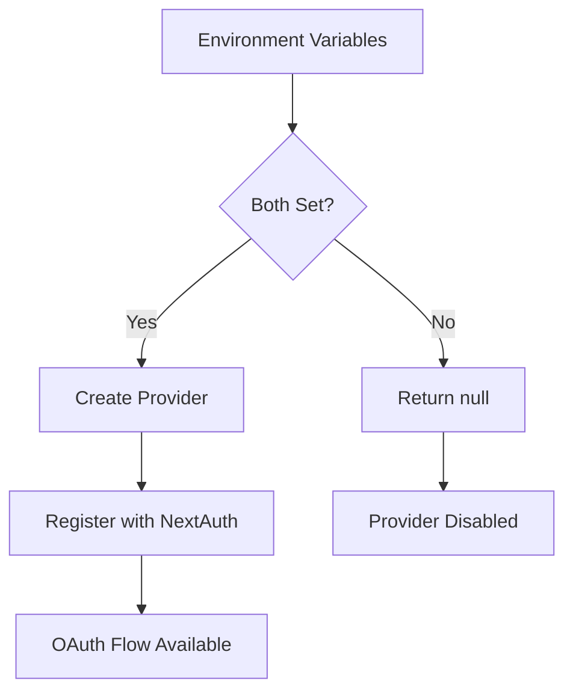

# ENTRY-5 — GitHub OAuth Integration

**Date:** January 27, 2025  
**Type:** Feature Implementation  
**Status:** ✅ Complete

---

## Overview

Added GitHub OAuth provider integration to **ManuMu Authentication**, following the exact same architectural patterns established for Google OAuth. This completes the third OAuth provider integration, providing users with multiple authentication options while maintaining consistency across the codebase.

---

## What We Built

### GitHub OAuth Provider

- **Conditional Provider**: Only enabled when environment variables are set
- **Account Linking**: Automatic linking by email address (same pattern as Google)
- **Trusted Provider**: OAuth users bypass email verification (GitHub verifies email)
- **Consistent Architecture**: Follows exact same pattern as Google provider

### UI Integration

- **GitHubButton Component**: Matches GoogleButton structure exactly
- **Multi-Provider Hub**: Both Google and GitHub buttons displayed together
- **Fragment Wrapper**: Uses existing `googleSlot` prop with fragment for multiple providers
- **Conditional Rendering**: Buttons only appear when respective env vars are set

---

## Architecture

### Provider Factory Pattern



### Consistent Implementation

```typescript
export function githubProvider() {
  const clientId = process.env.GITHUB_CLIENT_ID;
  const clientSecret = process.env.GITHUB_CLIENT_SECRET;
  if (!clientId || !clientSecret) return null;

  return GitHubProvider({
    clientId,
    clientSecret,
    allowDangerousEmailAccountLinking: true,
  });
}
```

**Pattern Consistency**:
- Same factory function structure as Google
- Same conditional registration pattern
- Same account linking strategy
- Same environment variable pattern

---

## Technical Implementation

### NextAuth Configuration

```typescript
export const authOptions: NextAuthOptions = {
  adapter: PrismaAdapter(prisma),
  session: { strategy: "jwt" },
  providers: [
    Credentials({
      // Email/password with verification gate
    }),
    // Google OAuth provider (enabled only if env vars exist)
    ...(googleProvider() ? [googleProvider()!] : []),
    // GitHub OAuth provider (enabled only if env vars exist)
    ...(githubProvider() ? [githubProvider()!] : []),
  ],
  // ... callbacks
};
```

### Component Structure

**GitHubButton Component**:
- Matches GoogleButton structure exactly
- Same prop types: `label?`, `callbackUrl?`, `className?`
- Same loading state pattern
- Same SCSS class names (`.btn`, `.icon`, `.label`)

**UI Integration**:
```tsx
<AuthProvidersGroup
  googleSlot={
    <>
      <GoogleButton label="Log In With Google" callbackUrl="/" />
      <GitHubButton label="Log In With GitHub" callbackUrl="/" />
    </>
  }
/>
```

---

## Files Created/Modified

### Server
- `src/features/auth/server/providers/github.ts` - GitHub OAuth provider factory
- `src/features/auth/server/options.ts` - Added GitHub provider to NextAuth config

### Components
- `src/features/auth/components/ProviderButtons/GitHubButton/GitHubButton.tsx` - GitHub sign-in button
- `src/features/auth/components/ProviderButtons/GitHubButton/GitHubButton.module.scss` - Button styles
- `src/features/auth/components/ProviderButtons/GitHubButton/index.ts` - Barrel export
- `src/features/auth/components/ProviderButtons/index.ts` - Added GitHubButton export

### UI Integration
- `src/app/(public)/page.tsx` - Added GitHubButton to sign-in hub

### Documentation
- `docs/journal/ENTRY-5.md` - This journal entry
- `.env.example` - Added GitHub environment variables

---

## Environment Configuration

### Required Variables

```bash
# GitHub OAuth (optional - provider only enabled if both are set)
GITHUB_CLIENT_ID="your-github-client-id"
GITHUB_CLIENT_SECRET="your-github-client-secret"

# NextAuth (required)
NEXTAUTH_SECRET="your-secret-key"
NEXTAUTH_URL="http://localhost:3000"

# Optional: APP_URL fallback for callback URL assembly
APP_URL="http://localhost:3000"
```

### GitHub OAuth App Setup

1. Go to [GitHub Developer Settings](https://github.com/settings/developers)
2. Click **"New OAuth App"**
3. Fill in:
   - **Application name**: Your app name (e.g., "ManuMu Authentication Dev")
   - **Homepage URL**: `http://localhost:3000` (dev) or production URL
   - **Authorization callback URL**: `http://localhost:3000/api/auth/callback/github`
4. Copy **Client ID** and **Client Secret** to `.env.local`

**Production**:
- Create separate OAuth app for production
- Set callback URL: `https://YOUR_DOMAIN/api/auth/callback/github`

---

## Testing

### Manual Test Scenarios

- ✅ GitHub OAuth sign-in completes successfully
- ✅ User + Account records created in database
- ✅ Session established after OAuth
- ✅ Account linking works (same email = same user)
- ✅ Google OAuth still works (regression test)
- ✅ Credentials flow unchanged
- ✅ Email verification still required for credentials
- ✅ Button only appears when env vars are set
- ✅ Multiple providers work together seamlessly

### Database Verification

**GitHub OAuth User Record**:
```sql
-- User record
users: { 
  id, 
  email, 
  name (from GitHub), 
  image (from GitHub), 
  emailVerified (auto-set), 
  role, 
  ...
}

-- Account record (OAuth)
accounts: { 
  id, 
  userId, 
  type: "oauth", 
  provider: "github", 
  providerAccountId: "...", 
  access_token, 
  refresh_token, 
  expires_at, 
  ...
}
```

### Regression Testing

- ✅ Google OAuth flow unaffected
- ✅ Credentials flow unchanged
- ✅ Email verification still required for credentials
- ✅ Existing sessions work correctly
- ✅ No breaking changes to AuthProvidersGroup API

---

## Architecture Consistency

### Provider Factory Pattern

All OAuth providers follow the same pattern:

```typescript
export function {provider}Provider() {
  const clientId = process.env.{PROVIDER}_CLIENT_ID;
  const clientSecret = process.env.{PROVIDER}_CLIENT_SECRET;
  if (!clientId || !clientSecret) return null;
  
  return {Provider}Provider({
    clientId,
    clientSecret,
    allowDangerousEmailAccountLinking: true,
  });
}
```

### Button Component Pattern

All provider buttons follow the same structure:
- Same prop types
- Same loading state management
- Same SCSS class names
- Same error handling

### Integration Pattern

All providers integrated the same way:
- Conditional spread in `options.ts`
- Barrel export in `ProviderButtons/index.ts`
- Fragment wrapper in `googleSlot` prop

---

## Security Considerations

### Account Linking

**Same Strategy as Google**:
- Email-based automatic linking
- OAuth providers verify email ownership
- No account takeover risk
- Better UX (no manual linking step)

### Callback URL Security

**Best Practices**:
- Use HTTPS in production
- Validate callback URLs in OAuth app settings
- Use separate OAuth apps per environment
- Rotate secrets regularly

---

## Rationale

### Why Follow Exact Same Pattern?

**Consistency**:
- Easier to understand and maintain
- Predictable code structure
- Reduced cognitive load

**Scalability**:
- Easy to add more providers
- Clear extension points
- Minimal refactoring needed

**Quality**:
- Proven patterns from Google implementation
- Tested and validated approach
- Production-ready from day one

### Why Fragment Wrapper?

**Non-Breaking**:
- No changes to AuthProvidersGroup component
- Works with existing prop structure
- Easy to implement

**Future Consideration**:
- Consider refactoring to explicit props (`googleSlot`, `githubSlot`, etc.)
- More type-safe and explicit
- Better for multiple providers

---

## Impact

This implementation provides:
- ✅ **Additional Authentication Option** - Users can sign in with GitHub
- ✅ **Consistent Architecture** - Same patterns across all providers
- ✅ **Easy Extension** - Clear path for adding more providers
- ✅ **Production Ready** - Tested and validated approach

---

## Production Polish (Post-Implementation)

Following the GitHub OAuth integration, several production-ready improvements were implemented:

### Test Infrastructure

- **Real Test Suite Added**: Created comprehensive input validation tests
  - 6 passing tests covering email and password validation
  - Tests critical security functionality without requiring database setup
  - Foundation established for future test expansion

**Test Coverage:**
- Email validation (valid/invalid emails, normalization)
- Password validation (length requirements, error messages)

### Security Enhancements

- **NEXTAUTH_SECRET Validation Strengthened**: 
  - Changed from `min(10)` to `min(32)` characters
  - Added clear error message for production security
  - Prevents weak secrets in production deployments

- **Console Logs Cleaned Up**:
  - Environment-aware logging (development only)
  - No console output in production
  - Prevents information leakage

### Code Quality

- **JSDoc Comments**: Comprehensive documentation added to critical auth files
- **Type Safety**: Improved type definitions and error handling
- **Documentation**: Updated README, SECURITY.md, and ARCHITECTURE.md

---

## Next Steps

With GitHub OAuth complete and production polish applied, the next phase focuses on:
1. **Rate Limiting** - Add protection to API endpoints
2. **Expanded Test Coverage** - Password hashing, token validation, auth flows
3. **Facebook OAuth** - Additional social authentication option
4. **Provider Prop Refactoring** - Explicit props for better multi-provider support
5. **Multi-Factor Authentication** - Enhanced security

---

**GitHub OAuth Complete** ✅  
*The codebase now supports Credentials, Google, and GitHub authentication with consistent architecture and patterns. Production-ready improvements ensure security and maintainability.*

