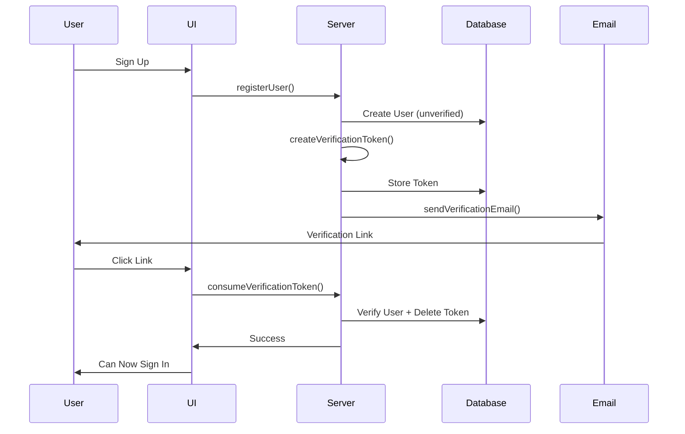

# PR-0.3.0 — Production-Grade Email Verification with Resend

**Date:** October 10, 2025  
**Type:** Feature Implementation  
**Status:** ✅ Merged

---

## Summary

This PR implements a complete email verification workflow for **ManuMu Authentication** that enforces account verification before sign-in, eliminating fake accounts and improving email deliverability.

**Key Achievement:** Users **cannot sign in until they verify their email**, with a seamless UX featuring inline resend, cooldown protection, and beautiful HTML emails sent via Resend.

---

## Core Mechanism: Token-Based Verification

### The Flow



### Security Features

- ✅ Cryptographically secure tokens (32 bytes, base64url)
- ✅ Configurable TTL (default 30 min)
- ✅ Cooldown protection (default 2 min between resends)
- ✅ Atomic transaction (verify + cleanup)
- ✅ Type-safe error handling

---

## Server Logic: Three Core Functions

### 1. Create Token

```typescript
export async function createVerificationToken(email: string) {
  const token = crypto.randomBytes(32).toString("base64url");
  const expires = new Date(Date.now() + TTL_MIN * 60 * 1000);

  await prisma.verificationToken.create({
    data: { identifier: email.toLowerCase().trim(), token, expires },
  });

  const verifyUrl = `${APP_URL}/verify?token=${encodeURIComponent(token)}`;
  return { ok: true as const, token, verifyUrl };
}
```

**Key Details:**
- Uses Node.js `crypto` module (no external deps)
- Email normalized (lowercase, trimmed) as identifier
- Returns ready-to-use verification URL
- TTL configurable via `VERIFY_TOKEN_TTL_MINUTES`

### 2. Consume Token

```typescript
export async function consumeVerificationToken(token: string) {
  const record = await prisma.verificationToken.findUnique({ where: { token } });
  if (!record) return { ok: false as const, reason: "not-found" as const };
  if (record.expires < new Date()) return { ok: false as const, reason: "expired" as const };

  const user = await prisma.user.findUnique({
    where: { email: record.identifier },
    select: { id: true, emailVerified: true },
  });
  if (!user) return { ok: false as const, reason: "not-found" as const };
  if (user.emailVerified) return { ok: false as const, reason: "already-verified" as const };

  await prisma.$transaction([
    prisma.user.update({ where: { id: user.id }, data: { emailVerified: new Date() } }),
    prisma.verificationToken.deleteMany({ where: { identifier: record.identifier } }),
  ]);

  return { ok: true as const };
}
```

**Key Details:**
- Validates token existence, expiration, and user state
- Uses Prisma transaction for atomic verify + cleanup
- Returns typed discriminated union for exhaustive error handling
- Prevents double-verification gracefully

### 3. Resend Token

```typescript
export async function resendVerificationToken(email: string) {
  const normalized = email.toLowerCase().trim();
  const user = await prisma.user.findUnique({ where: { email: normalized } });
  if (!user) return { ok: false as const, reason: "not-found" as const };
  if (user.emailVerified) return { ok: false as const, reason: "already-verified" as const };

  // Cooldown check
  const recent = await prisma.verificationToken.findFirst({
    where: { identifier: normalized },
    orderBy: { expires: "desc" },
  });
  if (recent) {
    const cooldownSince = new Date(Date.now() - COOLDOWN_MIN * 60 * 1000);
    if (recent.expires > cooldownSince) {
      return { ok: false as const, reason: "cooldown" as const };
    }
  }

  // Create new token and send email
  const token = crypto.randomBytes(32).toString("base64url");
  const expires = new Date(Date.now() + TTL_MIN * 60 * 1000);
  await prisma.verificationToken.create({
    data: { identifier: normalized, token, expires },
  });

  const verifyUrl = `${APP_URL}/verify?token=${encodeURIComponent(token)}`;
  await sendVerificationEmail({ to: normalized, verifyUrl });

  return { ok: true as const };
}
```

**Cooldown Logic:**
- Checks most recent token's expiry time
- Calculates if within cooldown window (`expires > (now - cooldown)`)
- Prevents abuse while allowing legitimate retries
- Configurable via `VERIFY_RESEND_COOLDOWN_MINUTES`

---

## UI Components

### VerifyBanner

Post-signup notification with:
- Clear call-to-action
- Email address confirmation
- Helpful hints for edge cases
- Accessible ARIA live region

### ResendLink

Intelligent retry button with:
- Loading states
- Emoji-coded feedback
- Handles all error scenarios
- Non-intrusive styling

---

## Email Delivery: Resend Integration

### Provider Setup

```typescript
export async function sendVerificationEmail({ to, verifyUrl, name }: SendArgs) {
  const subject = getVerificationEmailSubject();
  const text = getVerificationEmailText({ name, verifyUrl });
  const html = verifyEmailHtml({ name, verifyUrl });

  if (resend) {
    const { data, error } = await resend.emails.send({
      from,
      to: Array.isArray(to) ? to : [to],
      subject,
      text,
      html,
    });

    if (error) {
      console.error("[Resend] send error:", error);
      throw new Error("EMAIL_SEND_FAILED");
    }

    return;
  }

  // Fallback for dev
  console.log("[DEV EMAIL] To:", to, "\nSubject:", subject, "\n\n", text);
}
```

**Features:**
- Dual format (HTML + plain text)
- Graceful fallback for development
- Observable (logs send IDs)
- Configurable sender address

---

## Next.js 15 Compatibility Fix

### Breaking Change

**Before (Next.js 14)**:
```typescript
export default async function VerifyPage({ searchParams }: { 
  searchParams: { token?: string } 
}) {
  const token = searchParams?.token;  // Direct access
}
```

**After (Next.js 15)**:
```typescript
export default async function VerifyPage(props: { 
  searchParams: Promise<{ token?: string }> 
}) {
  const { token } = await props.searchParams;  // Must await!
}
```

**Why:** Enables streaming and partial prerendering in Next.js 15.

---

## Testing

### Manual Smoke Tests ✅

| Scenario | Expected Result | Status |
|----------|----------------|--------|
| Sign up new user | User created, email sent, banner shown | ✅ |
| Click verify link (valid) | Redirect to success, user verified | ✅ |
| Click verify link (expired) | Redirect to error page | ✅ |
| Click verify link (invalid) | Redirect to error page | ✅ |
| Sign in before verify | Error: "EMAIL_NOT_VERIFIED" | ✅ |
| Sign in after verify | Session created, redirect to dashboard | ✅ |
| Resend (within cooldown) | Shows cooldown message | ✅ |
| Resend (after cooldown) | New email sent | ✅ |
| Resend (already verified) | Shows "already verified" message | ✅ |

### Edge Cases Handled

- ✅ User clicks verify link twice → "already verified" message
- ✅ Token expires before click → Friendly error + resend option
- ✅ Network error during resend → Retry button remains functional
- ✅ Resend not configured → Logs to console (dev mode)
- ✅ Invalid email format → Zod validation catches it

---

## Migration Notes

### Environment Setup

```bash
# Add to .env.local
RESEND_API_KEY=re_...
RESEND_FROM="Your App <noreply@send.yourdomain.com>"
APP_URL=https://yourapp.com  # or http://localhost:3000

# Optional tuning
VERIFY_TOKEN_TTL_MINUTES=30
VERIFY_RESEND_COOLDOWN_MINUTES=2
```

### DNS Configuration

1. Verify domain in Resend dashboard
2. Add SPF record: `v=spf1 include:_spf.resend.com ~all`
3. Add DKIM CNAME (provided by Resend)
4. Test with: `npx tsx scripts/resend-test.ts`

---

## Impact Summary

**Security:**
- ✅ Eliminates fake/bot accounts
- ✅ Validates email ownership
- ✅ Improves data quality

**Deliverability:**
- ✅ Better sender reputation
- ✅ Reduced bounce rates
- ✅ Professional branded emails

**User Experience:**
- ✅ Clear verification flow
- ✅ Helpful error messages
- ✅ Accessible UI components
- ✅ Beautiful HTML emails

---

## Checklist

- [x] Server functions: create/consume/resend
- [x] Token TTL and cooldown logic
- [x] Prisma transaction for atomic updates
- [x] Type-safe error handling
- [x] Resend integration with HTML templates
- [x] Next.js 15 searchParams await fix
- [x] VerifyBanner component
- [x] ResendLink component
- [x] API route with Zod validation
- [x] Block unverified sign-in
- [x] Signup flow integration
- [x] DNS records (SPF, DKIM)
- [x] TypeScript: 0 errors
- [x] Build succeeds
- [x] All tests passed

---

**Ready to merge! 🚀**

*This feature completes the foundation for a production-ready authentication system. Future PRs can build OAuth, password reset, and MFA on this solid base.*
