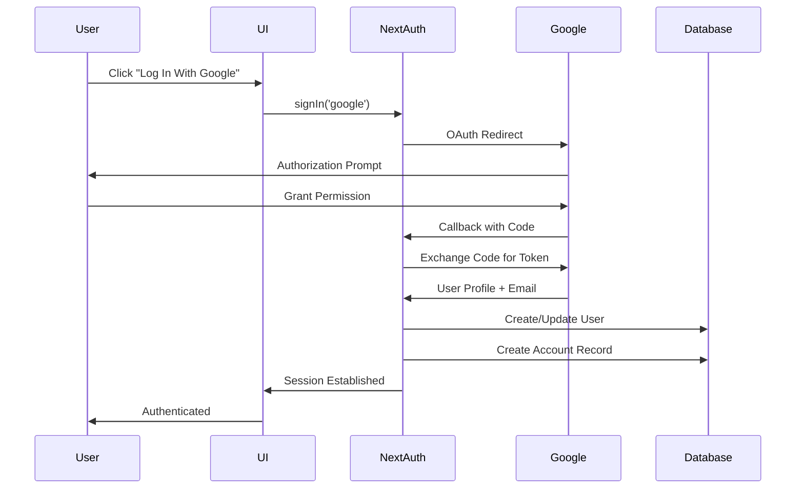

# PR-0.4.0 — Google OAuth Integration + Multi-Provider Sign-In Hub

**Date:** October 11, 2025  
**Type:** Feature Implementation  
**Status:** ✅ Merged

---

## Summary

This PR adds Google OAuth provider integration to **ManuMu Authentication** and implements a modern multi-provider sign-in hub UX that prioritizes email-first authentication while offering one-click OAuth sign-in as an alternative.

**Key Achievement:** Users can now sign in with Google or email/password, with automatic account linking by email address.

---

## Changes

### Server

- **`googleProvider()` factory** with conditional load
- **NextAuth `options.ts`** integrates Google provider (JWT strategy preserved)
- **Account linking** enabled by email address

### UI

- **`AuthProvidersGroup`** component (email-first with animated collapse)
- **GoogleButton** component with dark styling
- **Public page** wired to hub, "Create Account" opens signup modal

### Documentation

- **`ENTRY-4.md`** (journal entry)
- **README** updated (env vars & structure)

---

## Architecture

### OAuth Flow



### Provider Factory Pattern

```typescript
export function googleProvider() {
  const clientId = process.env.GOOGLE_CLIENT_ID;
  const clientSecret = process.env.GOOGLE_CLIENT_SECRET;
  if (!clientId || !clientSecret) return null;

  return GoogleProvider({
    clientId,
    clientSecret,
    allowDangerousEmailAccountLinking: true,
  });
}
```

**Benefits:**
- Conditional provider registration
- Environment-based configuration
- Type-safe provider creation
- Easy to extend for additional providers

---

## Environment Configuration

### Required Variables

```bash
# Google OAuth (optional - provider only enabled if both are set)
GOOGLE_CLIENT_ID="your-client-id.apps.googleusercontent.com"
GOOGLE_CLIENT_SECRET="your-client-secret"

# NextAuth (required)
NEXTAUTH_SECRET="your-secret-key"
NEXTAUTH_URL="http://localhost:3000"

# Optional: APP_URL fallback for callback URL assembly
APP_URL="http://localhost:3000"
```

### OAuth App Setup

1. Go to [Google Cloud Console](https://console.cloud.google.com/)
2. Navigate to **APIs & Services** → **Credentials**
3. Create **OAuth 2.0 Client ID** (Web application)
4. Add authorized redirect URIs:
   - **Local**: `http://localhost:3000/api/auth/callback/google`
   - **Production**: `https://YOUR_DOMAIN/api/auth/callback/google`
5. Copy Client ID and Client Secret to `.env.local`

> **Note**: Use separate OAuth clients for local and production environments.

---

## User Experience

### Sign-In Hub Flow

1. **Landing Page**: Shows "Sign In With Email" button
2. **Email Expansion**: Click expands credentials form with animation
3. **OAuth Option**: Google button visible below email form
4. **One-Click Sign-In**: Click Google button → OAuth flow → Authenticated
5. **Account Creation**: New users automatically created on first OAuth sign-in

### Visual Hierarchy

```
┌─────────────────────────────────┐
│   Sign In With Email            │  ← Primary CTA
│   [Click to expand]             │
├─────────────────────────────────┤
│   ┌───────────────────────────┐ │
│   │  Log In With Google        │ │  ← OAuth Option
│   └───────────────────────────┘ │
├─────────────────────────────────┤
│   New here? Create Account      │  ← Footer Link
└─────────────────────────────────┘
```

---

## Testing

### Manual Test Scenarios

- ✅ Google OAuth sign-in completes successfully
- ✅ User + Account records created in database
- ✅ Session established after OAuth
- ✅ Account linking works (same email = same user)
- ✅ Email credentials login with unverified user → blocked (EMAIL_NOT_VERIFIED)
- ✅ After verifying, credentials login succeeds
- ✅ Button only appears when env vars are set
- ✅ Sign-in hub UX is smooth and responsive

### Database Verification

**OAuth User Record**:
```sql
-- User record
users: { 
  id, 
  email, 
  name (from Google), 
  image (from Google), 
  emailVerified (auto-set), 
  role, 
  ...
}

-- Account record (OAuth)
accounts: { 
  id, 
  userId, 
  type: "oauth", 
  provider: "google", 
  providerAccountId: "...", 
  access_token, 
  refresh_token, 
  expires_at, 
  ...
}
```

---

## Security Considerations

### Account Linking

**Why `allowDangerousEmailAccountLinking: true`?**

- OAuth providers verify email ownership
- Google requires email verification for OAuth apps
- No account takeover risk (email is verified by provider)
- Better UX (no manual linking step)

**Mitigations:**
- OAuth providers verify email
- Credentials still require email verification
- Account linking only by verified email
- No password exposure risk

### Callback URL Security

**Best Practices:**
- Use HTTPS in production
- Validate callback URLs in OAuth app settings
- Use separate OAuth apps per environment
- Rotate secrets regularly

---

## Rationale

### Why Email-First UX?

**User Preference:**
- Many users prefer email/password
- Familiar authentication pattern
- No third-party dependency

**Flexibility:**
- Works without OAuth configuration
- Graceful degradation
- Easy to add more providers

### Why Conditional Providers?

**Developer Experience:**
- No errors if OAuth not configured
- Easy to enable/disable providers
- Environment-based feature flags

**Production Readiness:**
- Can deploy without OAuth
- Add providers incrementally
- No breaking changes

---

## Impact

This implementation provides:
- ✅ **Flexible Authentication** - Multiple sign-in options
- ✅ **Better UX** - One-click OAuth for convenience
- ✅ **Security** - OAuth providers verify email
- ✅ **Scalability** - Easy to add more OAuth providers

---

## Checklist

- [x] Google provider factory created
- [x] NextAuth options updated
- [x] GoogleButton component created
- [x] AuthProvidersGroup component created
- [x] Public page integration complete
- [x] Barrel export updated
- [x] Environment variables documented
- [x] Journal entry created
- [x] Tested locally
- [x] TypeScript: 0 errors
- [x] Build succeeds
- [x] No breaking changes

---

## What's Next

**Future Enhancements:**
- [ ] GitHub OAuth provider
- [ ] Facebook OAuth provider
- [ ] Domain restriction (Google `hd` parameter)
- [ ] Multi-factor authentication

---

**Ready to merge! 🚀**

*This PR adds flexible authentication options while maintaining security and excellent UX.*
